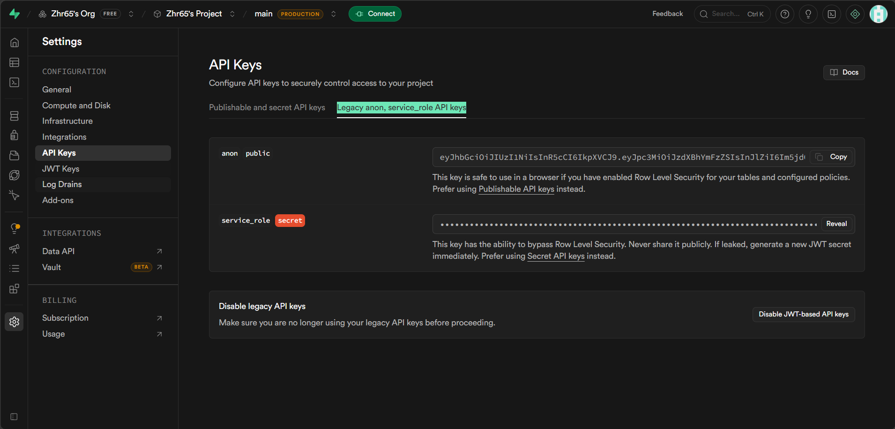
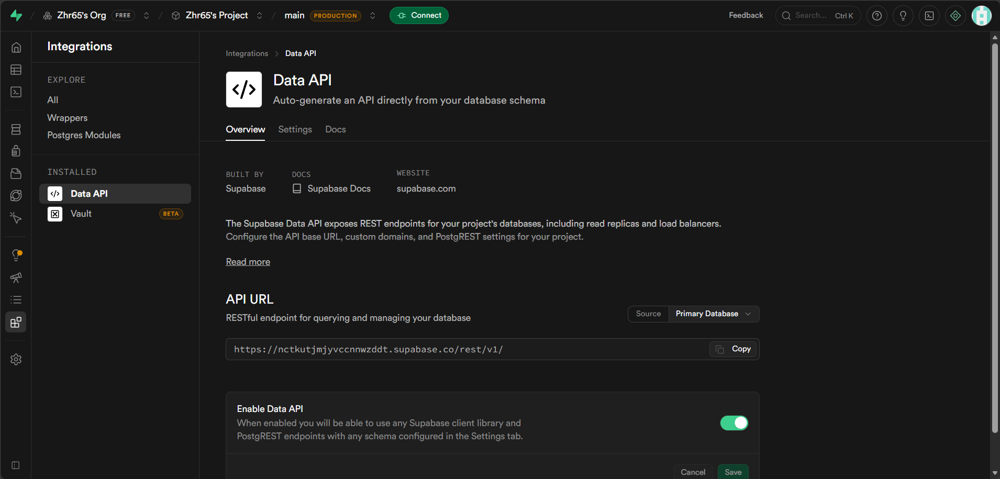

# 🌊 轻读

MD 阅读 · 灵感 · 倒数日 · 记忆 · 生活记录

---

## 自己部署（5 分钟）

### ① 创建数据库

[supabase.com](https://supabase.com) → 注册 → 创建项目 → SQL Editor → 粘贴 `setup.sql` → Run

### Settings → API → 记下 **Project URL** 和 **anon public key**




### ② 改配置

打开 `index.html`，找到开头这两行：

```javascript
const SUPABASE_URL='https://xxxxxxxx.supabase.co';    // ← 改成你的 Project URL
const SUPABASE_KEY='eyJhbGciOiJI...';                 // ← 改成你的 anon key
```

### ③ 部署

- **Gitee**：新建仓库 → 上传所有文件 → 服务 → Gitee Pages → 开启
- **GitHub**：新建仓库 → 上传所有文件 → Settings → Pages → 开启
- **拖拽部署**：[netlify](https://app.netlify.com/drop) → 得到链接

---

## 功能

| 📖 阅读 | 💡 灵感 | 📅 倒数日 | 🧠 记忆 | 🌸 生活 |
|---------|---------|----------|---------|---------|
| MD 导入 | 快速捕捉 | 农历/阳历 | 分类标签 | 照片+GPS |
| 自动保存 | 孵化→归档 | 倒数天数 | 全文搜索 | 美好瞬间 |

---

## 手机使用

- **iPhone**：Safari → 分享 → 添加到主屏幕
- **安卓**：Chrome → ⋮ → 安装应用
- **小组件**：Scriptable App → 导入 `widget.js`
